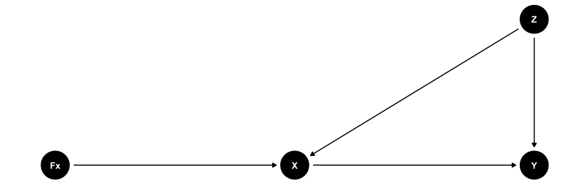

Backdoor Criterion
================
Hun Lee
11/26/2021

# Definition. (The Backdoor Criterion)

*Given an ordered pair of variables (X,Y) in a directed acyclic graph G,
a set of variables Z satisfies the backdoor criterion relative to (X, Y)
if no node in Z is a descendant of X, and Z blocks every path between X
and Y that contains an arrow into X.*

# Causal Effect.

If a set of variables Z satisfies the backdoor criterion for X and Y,
then the causal effect of X on Y is given by the formula:

*P*(*Y* = *y* ∣ *d**o*(*X* = *x*)) =
$\\sum\_{z}^{} P(Y=y \\mid X=x,Z= z)P(Z = z)$

To prove this, we introduce non-stochastic regime indicator and a
graphical model.

<!-- -->
